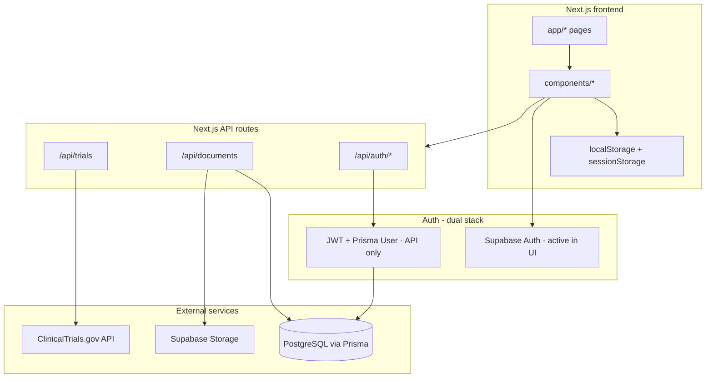

# Trial Bridge — Project Guide

This document describes **every file in the repository as it exists today**, what it does, and how the pieces connect. Use it alongside [README.md](../README.md) for environment setup and [ARCHITECTURE.md](./ARCHITECTURE.md) for high-level navigation (note: ARCHITECTURE.md is partially outdated — see [Redundancies & unused resources](#redundancies--unused-resources)).

**CliniQ | TrialBridge** is a Next.js 16 app that helps patients find clinical trials, upload medical documents, and provides role-specific dashboards for patients, healthcare professionals, and trial investigators.

---

## Table of contents

1. [How the app fits together](#how-the-app-fits-together)
2. [Root & configuration](#root--configuration)
3. [App router (`app/`)](#app-router-app)
4. [Components (`components/`)](#components-components)
5. [Hooks (`hooks/`)](#hooks-hooks)
6. [Libraries (`lib/`)](#libraries-lib)
7. [Express backend (`src/`)](#express-backend-src)
8. [Database (`prisma/`)](#database-prisma)
9. [Static assets (`public/`)](#static-assets-public)
10. [Archive (`archive/`)](#archive-archive)
11. [Documentation (`docs/`)](#documentation-docs)
12. [Redundancies & unused resources](#redundancies--unused-resources)

---

## How the app fits together

**Active user flow today**

1. User lands on `/` (Hero) → signs up or logs in via `/login` using **Supabase Auth**.
2. Role (`patient`, `healthcare-professional`, `investigator`) is stored in Supabase `user_metadata` and copied to **localStorage**.
3. Patient completes `/eligibility` form → data saved to **sessionStorage** → `/matches` runs client-side matching against `/api/trials`.
4. Patient uploads documents at `/patient/documents` → `/api/documents` → Prisma metadata + Supabase Storage.

**Important:** There is no Next.js `middleware.ts`. Pages and API routes are not server-side protected. JWT auth exists in parallel but is **not used by the login UI**.

---

## Root & configuration

| File | Purpose |
|------|---------|
| [`package.json`](../package.json) | Project metadata and scripts: `dev` (Next dev server), `build` (`next build`), `start`, `lint`. Dependencies include Next.js 16, React 19, Prisma, Supabase, Express, bcrypt, jsonwebtoken. **No** `postinstall` / `prisma generate` script. |
| [`package-lock.json`](../package-lock.json) | Locked dependency tree for reproducible installs. |
| [`tsconfig.json`](../tsconfig.json) | TypeScript config with strict mode and `@/*` path alias mapping to repo root. |
| [`next.config.ts`](../next.config.ts) | Next.js config — currently empty defaults (no security headers, redirects, or image domains). |
| [`next-env.d.ts`](../next-env.d.ts) | Auto-generated Next.js TypeScript references (gitignored). |
| [`eslint.config.mjs`](../eslint.config.mjs) | ESLint flat config extending `eslint-config-next` (core web vitals + TypeScript). |
| [`postcss.config.mjs`](../postcss.config.mjs) | PostCSS config loading Tailwind CSS v4 via `@tailwindcss/postcss`. |
| [`prisma.config.ts`](../prisma.config.ts) | Prisma 7 CLI config: schema path, migrations directory, `DATABASE_URL` datasource. |
| [`.gitignore`](../.gitignore) | Ignores `node_modules`, `.next`, `.env*` (except `.env.example` / `.env.local.example`), build artifacts, `.vercel`, generated Prisma client path. |
| [`.env.example`](../.env.example) | Template for all required environment variables (DB, Supabase, JWT). |
| [`.env.local.example`](../.env.local.example) | Near-duplicate of `.env.example` with slightly different placeholder URLs. |
| [`.env`](../.env) | Local secrets file (gitignored; not committed). |
| [`README.md`](../README.md) | Getting started, environment variable list, generic Vercel deploy blurb. |

---

## App router (`app/`)

Next.js App Router entry point. Each folder under `app/` maps to a URL route.

### Global

| File | Route / role | Purpose |
|------|--------------|---------|
| [`app/layout.tsx`](../app/layout.tsx) | All pages | Root HTML shell. Sets site title **"CliniQ \| TrialBridge"**, imports global CSS, renders `{children}`. |
| [`app/globals.css`](../app/globals.css) | — | Tailwind import + **Gemini-inspired design system**: CSS variables (`--gemini-canvas`, `--gemini-accent`, etc.), utility classes (`.gemini-btn`, `.gemini-card`, `.gemini-input`, headings, animations like `animate-float`). |
| [`app/page.tsx`](../app/page.tsx) | `/` | Home page. Wraps [`Hero`](../components/Hero.tsx) in [`PageShell`](../components/layout/PageShell.tsx). |
| [`app/favicon.ico`](../app/favicon.ico) | `/favicon.ico` | Browser tab icon. |

### Marketing & info pages

| File | Route | Purpose |
|------|-------|---------|
| [`app/about/page.tsx`](../app/about/page.tsx) | `/about` | Placeholder **"Coming Soon"** page inside PageShell. |
| [`app/how-it-works/page.tsx`](../app/how-it-works/page.tsx) | `/how-it-works` | Placeholder **"Coming Soon"** page inside PageShell. |
| [`app/get-started/page.tsx`](../app/get-started/page.tsx) | `/get-started` | Redirect helper. Accepts optional `?role=` query param, validates against [`ROLES`](../lib/constants/roles.ts), then redirects to `/login?mode=signup&role=...`. |

### Auth

| File | Route | Purpose |
|------|-------|---------|
| [`app/login/page.tsx`](../app/login/page.tsx) | `/login` | Login/signup page rendering [`AuthForm`](../components/AuthForm.tsx). Supports `?mode=signup` and `?role=` query params. |

### Patient routes

| File | Route | Purpose |
|------|-------|---------|
| [`app/patient/dashboard/page.tsx`](../app/patient/dashboard/page.tsx) | `/patient/dashboard` | Patient home — renders [`PatientDashboard`](../components/PatientDashboard.tsx). |
| [`app/patient/documents/page.tsx`](../app/patient/documents/page.tsx) | `/patient/documents` | Medical document upload/management — renders [`PatientDocumentsUpload`](../components/PatientDocumentsUpload.tsx). |
| [`app/eligibility/page.tsx`](../app/eligibility/page.tsx) | `/eligibility` | Multi-step eligibility questionnaire — renders [`TrialEligibilityForm`](../components/TrialEligibilityForm.tsx). |
| [`app/matches/page.tsx`](../app/matches/page.tsx) | `/matches` | Trial matching results — renders [`TrialsMatchView`](../components/TrialsMatchView.tsx). |

### Role dashboards

| File | Route | Purpose |
|------|-------|---------|
| [`app/investigator/dashboard/page.tsx`](../app/investigator/dashboard/page.tsx) | `/investigator/dashboard` | Investigator portal — renders [`InvestigatorDashboard`](../components/InvestigatorDashboard.tsx). |
| [`app/healthcare-professional/dashboard/page.tsx`](../app/healthcare-professional/dashboard/page.tsx) | `/healthcare-professional/dashboard` | **Does not render a dashboard.** Immediately redirects to `/login?mode=signup&role=healthcare-professional`. |

### API routes (`app/api/`)

| File | Endpoint | Methods | Purpose |
|------|----------|---------|---------|
| [`app/api/trials/route.ts`](../app/api/trials/route.ts) | `/api/trials` | `GET` | Proxy to ClinicalTrials.gov. Accepts `query`, `condition`, `location`, `status`, `phase`, `pageSize`, `pageToken`. Returns transformed trials via [`trialTransformers`](../lib/trialTransformers.ts). **No auth.** |
| [`app/api/trials/[nctId]/route.ts`](../app/api/trials/[nctId]/route.ts) | `/api/trials/:nctId` | `GET` | Fetches a single trial by NCT ID from ClinicalTrials.gov. **No auth.** |
| [`app/api/documents/route.ts`](../app/api/documents/route.ts) | `/api/documents` | `GET`, `POST` | **GET:** Lists medical documents from Prisma; optional `?patientId=` filter (if omitted, returns **all** documents). Generates 1-hour Supabase signed URLs. **POST:** Uploads file to Supabase Storage, creates Prisma `MedicalDocument` row. **No auth.** |
| [`app/api/documents/[id]/route.ts`](../app/api/documents/[id]/route.ts) | `/api/documents/:id` | `DELETE` | Deletes file from Supabase Storage and Prisma row. Optional `?patientId=` narrows lookup. **No auth.** |
| [`app/api/auth/route.ts`](../app/api/auth/route.ts) | `/api/auth` | `POST` | **Combined JWT auth handler.** Body field `action`: `login`, `refresh`, or `logout`. Uses Prisma `User` + bcrypt + [`lib/auth.ts`](../lib/auth.ts). **Not called by the UI** (AuthForm uses Supabase). |
| [`app/api/auth/login/route.ts`](../app/api/auth/login/route.ts) | `/api/auth/login` | `POST` | Standalone JWT login (email/password → access + refresh tokens). Duplicate of `action=login` in `/api/auth`. |
| [`app/api/auth/refresh/route.ts`](../app/api/auth/refresh/route.ts) | `/api/auth/refresh` | `POST` | Standalone JWT refresh token exchange. |
| [`app/api/auth/logout/route.ts`](../app/api/auth/logout/route.ts) | `/api/auth/logout` | `POST` | Standalone JWT logout (revokes refresh token in DB). |

---

## Components (`components/`)

React UI components used by App Router pages.

### Layout

| File | Purpose |
|------|---------|
| [`components/layout/PageShell.tsx`](../components/layout/PageShell.tsx) | Shared page wrapper: renders [`Header`](../components/Header.tsx), applies max-width container. `fullWidth` prop skips inner padding wrapper for dashboards. |
| [`components/Header.tsx`](../components/Header.tsx) | Top navigation bar with CliniQ branding (`/SeparateLogo.png`), links to Home, Get Started, How it Works, About, Login. Conditionally shows [`DashboardNavLink`](../components/DashboardNavLink.tsx). |
| [`components/DashboardNavLink.tsx`](../components/DashboardNavLink.tsx) | Client component. Shows "Dashboard" link to `/patient/dashboard` only when eligibility form is complete (checks [`hasCompletedEligibilityForm()`](../lib/eligibility/storage.ts)). **Not tied to authentication.** |

### Marketing

| File | Purpose |
|------|---------|
| [`components/Hero.tsx`](../components/Hero.tsx) | Landing hero section: headline, CTA to `/login?mode=signup`, embeds [`HeroGallery`](../components/HeroGallery.tsx). |
| [`components/HeroGallery.tsx`](../components/HeroGallery.tsx) | Zigzag image gallery using `/patient-care.png`, `/samples.png`, `/after-care.png` with hover captions. |

### Auth

| File | Purpose |
|------|---------|
| [`components/AuthForm.tsx`](../components/AuthForm.tsx) | Login/signup form (client). Uses **Supabase Auth** via [`lib/auth/supabase.ts`](../lib/auth/supabase.ts). On signup: stores role + optional patient type in Supabase metadata and localStorage. Redirects to role-specific dashboard. Supports patient type selection for patients. |

### Patient experience

| File | Purpose |
|------|---------|
| [`components/TrialEligibilityForm.tsx`](../components/TrialEligibilityForm.tsx) | Multi-category eligibility wizard (demographics, diagnosis, labs, etc.). Field definitions from [`formConfig`](../lib/eligibility/formConfig.ts). Saves to sessionStorage. On completion, syncs patient type to Supabase metadata for patient role and navigates to `/matches`. |
| [`components/TrialsMatchView.tsx`](../components/TrialsMatchView.tsx) | Trial matching UI: loads profile from sessionStorage via [`useMatchedTrials`](../hooks/useMatchedTrials.ts), displays ranked matches with tabs (overview, eligibility, details), save/apply actions (client-side state only). |
| [`components/PatientDashboard.tsx`](../components/PatientDashboard.tsx) | Patient summary dashboard: eligibility snapshot from sessionStorage, document count from API, quick links to eligibility, matches, and documents. Calls `listMedicalDocuments()` **without patientId**. |
| [`components/PatientDocumentsUpload.tsx`](../components/PatientDocumentsUpload.tsx) | Document upload UI by category. Manages `patientId` in localStorage (generates UUID if missing). Upload/list/delete via [`lib/documents/storage.ts`](../lib/documents/storage.ts). |

### Role dashboards

| File | Purpose |
|------|---------|
| [`components/InvestigatorDashboard.tsx`](../components/InvestigatorDashboard.tsx) | Investigator study management UI. Fetches recruiting trials via [`useTrials`](../hooks/useTrials.ts), merges with **mock participant/enrollment data** from [`mockStudies`](../lib/mock/studies.ts). Falls back entirely to mock data if API returns empty. Supports study detail view, participant list, and edit mode (local state). |
| [`components/HealthcareProfessionalDashboard.tsx`](../components/HealthcareProfessionalDashboard.tsx) | HCP dashboard UI built entirely on **mock patients** ([`mockPatients`](../lib/mock/patient.ts)). Patient list, trial assignment view, chat panel placeholder. Fetches trial details via [`useTrialById`](../hooks/useTrialById.ts). **Not mounted by any page** — the HCP route redirects to login instead. |

---

## Hooks (`hooks/`)

Client-side React hooks for data fetching.

| File | Purpose |
|------|---------|
| [`hooks/useTrials.ts`](../hooks/useTrials.ts) | Fetches trials from `/api/trials` with optional filters (condition, location, status, phase). Returns `{ trials, loading, error }`. Used by InvestigatorDashboard. |
| [`hooks/useTrialById.ts`](../hooks/useTrialById.ts) | Fetches a single trial from `/api/trials/:nctId`. Used by HealthcareProfessionalDashboard. |
| [`hooks/useMatchedTrials.ts`](../hooks/useMatchedTrials.ts) | Loads eligibility form from sessionStorage, converts to profile, fetches recruiting trials, runs [`matchTrialsToPatient()`](../lib/matching/matchTrials.ts). Used by TrialsMatchView. |

---

## Libraries (`lib/`)

Shared business logic, clients, and types.

### Database

| File | Purpose |
|------|---------|
| [`lib/prisma.ts`](../lib/prisma.ts) | Singleton `PrismaClient` instance. Reuses global in dev to avoid connection leaks during hot reload. |

### Supabase

| File | Purpose |
|------|---------|
| [`lib/supabase/client.ts`](../lib/supabase/client.ts) | Browser Supabase client using `NEXT_PUBLIC_SUPABASE_URL` and `NEXT_PUBLIC_SUPABASE_ANON_KEY`. Used for auth in AuthForm and TrialEligibilityForm. |
| [`lib/supabase/admin.ts`](../lib/supabase/admin.ts) | Server-side Supabase client with **service role key**. Used by document API routes for storage upload/delete and signed URLs. |

### Auth (dual implementations)

| File | Purpose |
|------|---------|
| [`lib/auth/supabase.ts`](../lib/auth/supabase.ts) | Supabase Auth helpers: `signUpWithRole`, `signInWithPassword`, `signOut`, `getCurrentUserProfile`, `updateUserMetadata`. **Active — used by UI.** |
| [`lib/auth/storage.ts`](../lib/auth/storage.ts) | localStorage helpers for role, email, patient type (`trialBridgeUserRole`, etc.). Used after Supabase login. |
| [`lib/auth.ts`](../lib/auth.ts) | JWT token generation/verification using env secrets. **Used by Next.js `/api/auth/*` routes.** Duplicates logic in `src/services/authService.ts`. |
| [`lib/constants/roles.ts`](../lib/constants/roles.ts) | Frontend role constants: `patient`, `healthcare-professional`, `investigator`. **Different naming** from Prisma enum (`doctor`, `trial_investigator`). |

### Clinical trials

| File | Purpose |
|------|---------|
| [`lib/clinicalTrialsApi.ts`](../lib/clinicalTrialsApi.ts) | Direct HTTP client for ClinicalTrials.gov API v2: `searchTrials()`, `getTrialById()`. Used by API routes (server-side). |
| [`lib/trialTransformers.ts`](../lib/trialTransformers.ts) | Maps raw ClinicalTrials.gov JSON to app-friendly `TransformedTrial` shape (title, phase, eligibility text, contact, etc.). Parses eligibility criteria into arrays. |

### Eligibility & matching

| File | Purpose |
|------|---------|
| [`lib/eligibility/types.ts`](../lib/eligibility/types.ts) | TypeScript types: `EligibilityFormData`, `PatientEligibilityProfile`, `TrialMatchEvaluation`, category IDs. |
| [`lib/eligibility/formConfig.ts`](../lib/eligibility/formConfig.ts) | Form field definitions per category, validation (`validateRequiredFields`), category ordering. |
| [`lib/eligibility/fieldOptions.ts`](../lib/eligibility/fieldOptions.ts) | Select options: diagnoses, biomarkers, mutations, US states, etc. |
| [`lib/eligibility/storage.ts`](../lib/eligibility/storage.ts) | sessionStorage persistence for eligibility form (`trial-bridge-eligibility-profile`). |
| [`lib/eligibility/profileFromForm.ts`](../lib/eligibility/profileFromForm.ts) | Converts flat form strings to typed `PatientEligibilityProfile`; builds ClinicalTrials.gov search params from profile. |
| [`lib/matching/parseCriteria.ts`](../lib/matching/parseCriteria.ts) | Low-level parsers: age strings, ECOG scores, biomarker tokens, lab thresholds, condition matching helpers. |
| [`lib/matching/matchTrials.ts`](../lib/matching/matchTrials.ts) | Core matching engine: scores trials against patient profile (age, sex, labs, ECOG, condition, exclusions). Minimum score threshold `MIN_MATCH_SCORE = 55`. |

### Documents

| File | Purpose |
|------|---------|
| [`lib/documents/types.ts`](../lib/documents/types.ts) | `MedicalDocumentTypeId` union and `MedicalDocumentRecord` interface. |
| [`lib/documents/categories.ts`](../lib/documents/categories.ts) | Display metadata for document types (blood test, MRI, pathology, etc.). |
| [`lib/documents/storage.ts`](../lib/documents/storage.ts) | Browser-side fetch wrappers for `/api/documents` (list, upload via FormData, delete). |

### Mock data (development / fallback)

| File | Purpose |
|------|---------|
| [`lib/mock/types.ts`](../lib/mock/types.ts) | Types for mock `Patient`, `Study`, `Participant`, `TrialAssignment`. |
| [`lib/mock/patient.ts`](../lib/mock/patient.ts) | Three hardcoded mock patients with assigned trials. Used by HealthcareProfessionalDashboard. |
| [`lib/mock/studies.ts`](../lib/mock/studies.ts) | Hardcoded mock studies with participants, enrollment stats, status color maps. Used by InvestigatorDashboard as fallback and for participant data merge. |

---

## Express backend (`src/`)

A **standalone Express app** that duplicates JWT auth and provides demo RBAC routes. It is **not started** by any npm script and is **not integrated** with the Next.js deployment.

| File | Purpose |
|------|---------|
| [`src/server.ts`](../src/server.ts) | Express app setup: JSON middleware, mounts `/auth` routes, demo protected routes (`/doctors-only`, `/patients-and-doctors`, `/investigators-only`). Exports app but never calls `listen()`. |
| [`src/routes/authRoutes.ts`](../src/routes/authRoutes.ts) | Express router: `POST /login`, `/refresh`, `/logout` — same logic as Next.js auth API routes, using [`authService`](../src/services/authService.ts). |
| [`src/services/authService.ts`](../src/services/authService.ts) | JWT sign/verify + `saveRefreshToken()` via Prisma. Reads secrets from [`authConfig`](../src/config/authConfig.ts). **Duplicate of `lib/auth.ts`.** |
| [`src/config/authConfig.ts`](../src/config/authConfig.ts) | Loads and validates JWT env vars (`JWT_SECRET`, `JWT_EXPIRES_IN`, `REFRESH_TOKEN_SECRET`, `REFRESH_TOKEN_EXPIRES_IN`). Stricter than `lib/auth.ts` (requires expiry env vars). |
| [`src/middleware/authenticate.ts`](../src/middleware/authenticate.ts) | Express middleware: validates `Authorization: Bearer <token>` header, attaches `req.user`. |
| [`src/middleware/authorize.ts`](../src/middleware/authorize.ts) | Express middleware factory: checks `req.user.role` against allowed roles list. |
| [`src/types/auth.ts`](../src/types/auth.ts) | Express auth types: `Role` (`patient`, `doctor`, `trial_investigator`), `JwtPayload`, Express `Request` augmentation. |

---

## Database (`prisma/`)

| File | Purpose |
|------|---------|
| [`prisma/schema.prisma`](../prisma/schema.prisma) | PostgreSQL schema. **Models:** `Patient` + 10 category tables (Demographics, Diagnosis, MedicalHistory, etc.), `MedicalDocument`, `User`, `RefreshToken`. **Enum:** `Role` (`patient`, `doctor`, `trial_investigator`). Only `MedicalDocument`, `User`, and `RefreshToken` are used in app code today; Patient/category models have **no read/write code**. |
| [`prisma/migrations/migration_lock.toml`](../prisma/migrations/migration_lock.toml) | Locks migration provider to PostgreSQL. |
| [`prisma/migrations/20260601060750_add_medical_documents/migration.sql`](../prisma/migrations/20260601060750_add_medical_documents/migration.sql) | Initial migration: creates Patient, all category tables, MedicalDocument, indexes, and foreign keys. |
| [`prisma/migrations/20260607120000_add_users_refresh_tokens/migration.sql`](../prisma/migrations/20260607120000_add_users_refresh_tokens/migration.sql) | Adds `Role` enum, `users`, and `refresh_tokens` tables for JWT auth. |

---

## Static assets (`public/`)

Files served at the site root (`/filename`).

| File | Used by | Notes |
|------|---------|-------|
| [`SeparateLogo.png`](../public/SeparateLogo.png) | Header | Active logo. |
| [`patient-care.png`](../public/patient-care.png) | HeroGallery | Active. |
| [`samples.png`](../public/samples.png) | HeroGallery | Active. |
| [`after-care.png`](../public/after-care.png) | HeroGallery | Active. |
| [`logo.png`](../public/logo.png) | — | **Unused** in source. |
| [`logo original.png`](../public/logo%20original.png) | — | **Unused** in source. |
| [`OGLogo.png`](../public/OGLogo.png) | — | **Unused** (likely intended for Open Graph meta). |
| [`file.svg`](../public/file.svg) | — | Default create-next-app asset; **unused**. |
| [`globe.svg`](../public/globe.svg) | — | Default create-next-app asset; **unused**. |
| [`next.svg`](../public/next.svg) | — | Default create-next-app asset; **unused**. |
| [`vercel.svg`](../public/vercel.svg) | — | Default create-next-app asset; **unused**. |
| [`window.svg`](../public/window.svg) | — | Default create-next-app asset; **unused**. |

---

## Archive (`archive/`)

Old prototype components moved out of `components/`. **None are imported** by the active app.

| File | Purpose |
|------|---------|
| [`archive/PromptInput.tsx`](../archive/PromptInput.tsx) | Simple textarea input — early UI building block. |
| [`archive/ResponseView.tsx`](../archive/ResponseView.tsx) | Displays text response — early UI building block. |
| [`archive/RunButton.tsx`](../archive/RunButton.tsx) | Generic action button — early UI building block. |
| [`archive/Works.tsx`](../archive/Works.tsx) | Large **PDF Parser with GPT-4o** prototype: uploads PDF, calls OpenAI API with user-supplied API key, extracts structured medical document JSON. Includes commented notes about ClinicalTrials.gov integration. Superseded by current document upload flow. |

---

## Documentation (`docs/`)

| File | Purpose |
|------|---------|
| [`docs/ARCHITECTURE.md`](./ARCHITECTURE.md) | Brief navigation flow diagram. **Outdated:** references deleted `RoleSelection.tsx` and old component paths. |
| [`docs/PROJECT_GUIDE.md`](./PROJECT_GUIDE.md) | This file. |

---

## Redundancies & unused resources

### Critical architectural duplication

| Issue | Details | Recommendation |
|-------|---------|----------------|
| **Dual auth systems** | UI uses Supabase Auth; JWT + Prisma `User` exists in `/api/auth/*` and `src/` but is never called from AuthForm. | Pick one auth path and remove or integrate the other. |
| **Duplicate JWT logic** | [`lib/auth.ts`](../lib/auth.ts) and [`src/services/authService.ts`](../src/services/authService.ts) do the same thing with different config loading. | Consolidate into one module. |
| **Duplicate auth API routes** | [`/api/auth`](../app/api/auth/route.ts) combines login/refresh/logout; separate routes under `/api/auth/login`, `/refresh`, `/logout` repeat the same logic; Express [`authRoutes.ts`](../src/routes/authRoutes.ts) repeats again. | Keep one route shape (combined or split), delete the rest. |
| **Role name mismatch** | Frontend: `healthcare-professional`, `investigator`. Prisma/Express: `doctor`, `trial_investigator`. | Align enums and metadata across all layers. |
| **Express server dead code** | [`src/server.ts`](../src/server.ts) is never run; `express` dependency only serves this unused stack. | Remove `src/` or add a deploy script if needed. |

### Unused components & routes

| Resource | Status |
|----------|--------|
| [`HealthcareProfessionalDashboard.tsx`](../components/HealthcareProfessionalDashboard.tsx) | Fully built but **never rendered** — page redirects to login. |
| [`app/healthcare-professional/dashboard/page.tsx`](../app/healthcare-professional/dashboard/page.tsx) | Redirect stub only. |
| [`archive/*`](../archive/) | Four archived prototype files, zero imports. |
| Prisma `Patient` + category models | Schema + migration exist; **no application code** reads or writes them. Eligibility lives in sessionStorage instead. |

### Mock data in production paths

| Resource | Risk |
|----------|------|
| [`InvestigatorDashboard.tsx`](../components/InvestigatorDashboard.tsx) | Falls back to full `mockStudies` when API returns no trials; always merges mock participants/enrollment. |
| [`HealthcareProfessionalDashboard.tsx`](../components/HealthcareProfessionalDashboard.tsx) | 100% mock patients (if ever wired up). |
| No `NODE_ENV` guards | Mock data can appear in production builds. |

### Redundant config files

| Files | Issue |
|-------|-------|
| [`.env.example`](../.env.example) vs [`.env.local.example`](../.env.local.example) | Nearly identical; maintain one template. |

### Unused public assets

`logo.png`, `logo original.png`, `OGLogo.png`, and all default Next.js SVGs (`file.svg`, `globe.svg`, `next.svg`, `vercel.svg`, `window.svg`) are not referenced in code.

### Outdated documentation

[`docs/ARCHITECTURE.md`](./ARCHITECTURE.md) describes a flow through `RoleSelection.tsx` and direct dashboard routing without login — that component was removed; current flow goes through `/login` and Supabase.

### Missing pieces (not redundant, but gaps)

- No `middleware.ts` for route protection.
- No tests, CI workflows, or monitoring.
- No `prisma generate` in build scripts.
- Patient IDs for documents are client-generated UUIDs in localStorage, not tied to Supabase user or Prisma `Patient` rows.
- Document API has no authentication — highest security concern for production.

---

## Quick reference: which auth path is active?

| Layer | Technology | Active? |
|-------|------------|---------|
| Login UI | Supabase Auth | **Yes** |
| Role storage | localStorage | **Yes** (client-only, spoofable) |
| Eligibility data | sessionStorage | **Yes** |
| JWT API routes | Prisma User + bcrypt | Implemented, **not used by UI** |
| Express `src/` | JWT + RBAC demos | **Not running** |
| Server route protection | — | **None** |

---

*Last updated to reflect repository state as of project exploration. Regenerate or extend this guide when major files are added, removed, or rewired.*
